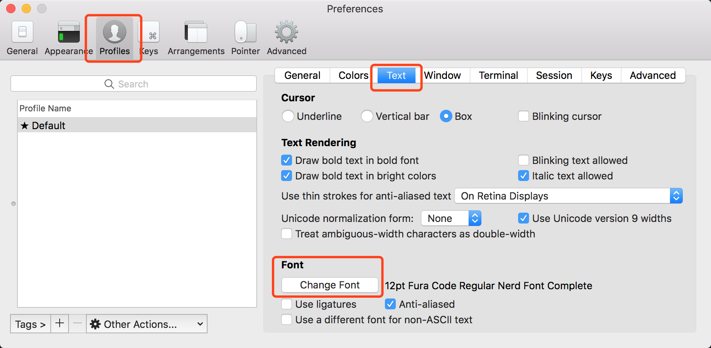
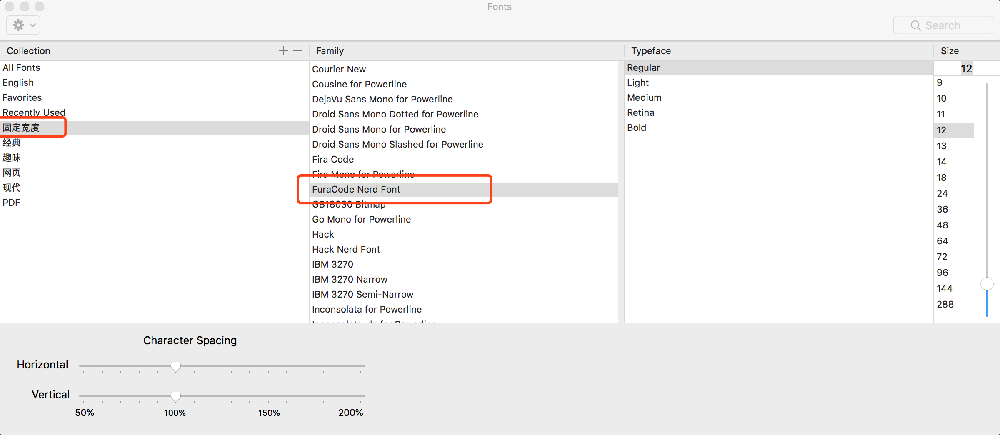
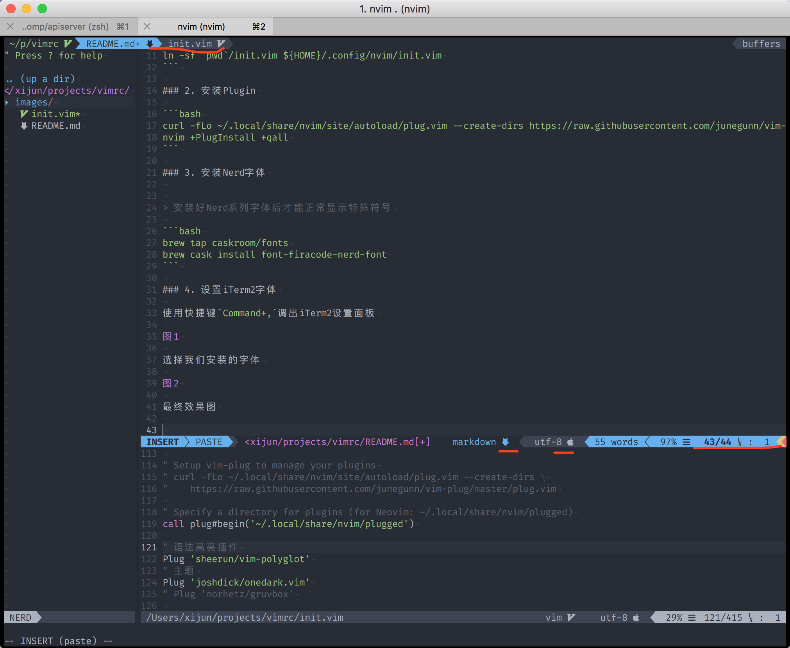

# Neovim 配置文件

依赖:

- git
- Neovim
- HomeBrew
- iTerm2

## 安装

### 1. 下载配置

```bash
mkdir -p ${HOME}/.config/nvim/
git clone https://github.com/daixijun/vimrc.git
ln -sf `pwd`/vimrc/init.vim ${HOME}/.config/nvim/init.vim
```

### 2. 安装Plugin

```bash
curl -fLo ~/.local/share/nvim/site/autoload/plug.vim --create-dirs https://raw.githubusercontent.com/junegunn/vim-plug/master/plug.vim
nvim +PlugInstall +qall
```

### 3. 安装Nerd字体


> 安装好Nerd系列字体后才能正常显示特殊符号

```bash
brew tap caskroom/fonts
brew cask install font-firacode-nerd-font
```

### 4. 设置iTerm2字体

使用快捷键`Command+,`调出iTerm2设置面板



选择我们安装的字体



最终效果图



可以看到红线标注处的特殊字符都可以显示正常
